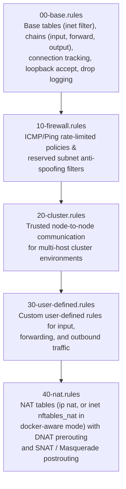

# Ansible Role: NFTables

|Source|Version|CI|License|
|------|-------|--|-------|
|[](https://github.com/grzegorzfranus/ansible-role-nftables)|[](https://github.com/grzegorzfranus/ansible-role-nftables/releases)|[](https://github.com/grzegorzfranus/ansible-role-nftables/actions/workflows/ci.yml)|[](LICENSE)|

This Ansible role installs, configures, hardens, and manages NFTables, the modern Linux kernel packet classification framework. It provides a modular, enterprise-grade firewall solution featuring stateful connection tracking, rate-limited logging, anti-spoofing bogon filtering, cluster interconnect policies, user-defined rules, NAT / port forwarding, and automatic conflict mitigation.

## ✨ Features

- 🛡️ **Modular Rule Architecture**: Divides firewall rules into distinct, sequentially loaded configuration files (`00-base` through `40-nat`)
- 🔒 **Stateful Connection Tracking**: Automatic handling of `ct state established,related` with configurable default drop/reject policies
- 🚫 **Anti-Spoofing & Reserved Range Filtering**: Built-in, customizable blocking of IETF/IANA reserved and bogon address spaces on external interfaces
- 👥 **Cluster Interconnect Support**: Dedicated rules for trusted node-to-node communication across distributed cluster systems
- 🔀 **Integrated NAT & Port Forwarding**: Native DNAT (prerouting) and SNAT / Masquerading (postrouting) support
- 📝 **Rate-Limited Logging & Logrotate**: Drop-packet logging with configurable burst/rate limits and automated log rotation
- 🛑 **Conflict Service Mitigation**: Automatically detects, stops, and disables conflicting firewall daemons (`firewalld`, `iptables`, `ufw`, `netfilter-persistent`)
- 🧪 **Molecule Tested**: Multi-distribution testing across Ubuntu 26.04/24.04/22.04, Debian 13/12/11, and Rocky Linux 9
- 🔄 **Idempotent & Safe Execution**: Pre-validates all generated rule files via `nft -c -f` before applying service reloads

## 🎯 Architecture

The role structures firewall rules into a modular hierarchy inside `/etc/nftables/rules/`. The main configuration file (`/etc/nftables.conf` or `/etc/nftables/nftables.conf`) includes these files in strict lexicographical order:



### Modular Rule Evaluation Sequence

1. **`00-base.rules`**: Establishes the `inet filter` table, sets base chain policies (`drop`/`accept`), allows `established,related` traffic, permits loopback traffic, and configures rate-limited drop logging.
2. **`10-firewall.rules`**: Applies ICMP/ping rate limiting and blocks reserved/bogon IPv4 subnets from entering external interfaces.
3. **`20-cluster.rules`**: Permits bidirectional traffic among explicitly configured cluster node IPs on defined service ports.
4. **`30-user-defined.rules`**: Evaluates custom firewall rules defined by administrators for input, forward, and output chains.
5. **`40-nat.rules`**: Defines the NAT table (`ip nat` by default, or `inet nftables_nat` when [Docker-Aware Mode](#docker-aware-mode) is enabled) for destination NAT (port forwarding) and source NAT / masquerading.

## 📋 Requirements

- **Ansible**: 2.15 or higher
- **Python**: 3.9 or higher on target hosts
- **Privileges**: sudo/root access on target hosts

### Supported operating systems

List of officially supported operating systems for this role:

| OS Family | Version | Status |
|-----------|---------|---------|
| Ubuntu | 26.04 (Resolute) |  |
| Ubuntu | 24.04 (Noble) |  |
| Ubuntu | 22.04 (Jammy) |  |
| Debian | 13 (Trixie)   |  |
| Debian | 12 (Bookworm) |  |
| Debian | 11 (Bullseye) |  |
| EL (RHEL, Rocky, Alma) | 9 |  |

### Setup module

The role relies on facts gathered by Ansible on the remote host (`ansible_facts['os_family']`, `ansible_facts['distribution']`). If you disable the Setup module in your playbook, the role will not function properly.

### Root access

This role requires root privileges to install packages, configure kernel firewall tables, and manage systemd services. Ensure `become: true` is configured at the play or role level.

## 🚀 Quick Start

### 1. Basic Firewall Setup

```yaml
---
- name: Configure NFTables Firewall
  hosts: all
  become: true
  roles:
    - role: grzegorzfranus.nftables
      vars:
        nftables_service_enabled: true
        nftables_configure_logrotate: true
        nftables_input_default_policy: "drop"
        nftables_forward_default_policy: "drop"
        nftables_output_default_policy: "accept"
        nftables_user_defined_input_enabled: true
        nftables_user_defined_input_rules:
          - protocol: "tcp"
            port: "22"
            action: "accept"
            comment: "Allow SSH management"
```

### 2. Run the playbook

```bash
ansible-playbook -i inventory firewall-setup.yml
```

## ⚙️ Configuration

### Default Configuration

The role comes with secure, production-ready defaults:

```yaml
nftables_service_enabled: true
nftables_configure_logrotate: true
nftables_configure_security_rules: false
nftables_docker_aware: false
nftables_docker_aware_bridge_interfaces:
  - "docker0"
nftables_reboot_required: false

nftables_input_default_policy: "drop"
nftables_forward_default_policy: "drop"
nftables_output_default_policy: "drop"

nftables_log_input_dropped: true
nftables_log_forward_dropped: true
nftables_log_output_dropped: true
```

### Docker-Aware Mode

When running on a host with Docker installed, standard firewall reloads can break container networking because `flush ruleset` wipes Docker's iptables-nft translation rules (in kernel tables `ip filter` and `ip nat`).

To resolve this, enable Docker-aware mode:

```yaml
nftables_docker_aware: true
nftables_docker_aware_bridge_interfaces:
  - "docker0"
```

#### What Docker-Aware Mode Changes

1. **Scoped Table Flush**: Replaces global `flush ruleset` with atomic table flushing (`table inet filter` declare/delete/define), ensuring Docker's `ip filter` and `ip nat` tables are untouched during service reloads.
2. **Dedicated NAT Table**: Relocates the role's NAT rules from `table ip nat` to a dedicated `table inet nftables_nat`. This prevents collision with Docker's native NAT chains (`DOCKER`, `POSTROUTING`).
3. **Container Egress Forwarding**: Automatically allows outbound container traffic from specified bridge interfaces (`iifname "docker0" accept`) in the `forward` chain. Return traffic is automatically permitted via existing connection tracking (`ct state established,related`).

#### Published Ports Consequence (Inbound Container Access)

Because the forward chain policy defaults to `drop`, **inbound traffic to published container ports is not automatically accepted**. Inbound connections forwarded to containers (post-DNAT) must be explicitly allowed using `nftables_user_defined_forward_rules`:

```yaml
nftables_user_defined_forward_enabled: true
nftables_user_defined_forward_rules:
  - protocol: "tcp"
    port: "80,443"
    action: "accept"
    comment: "Allow inbound HTTP/HTTPS to published containers"
```

#### Migration Notes

- **Legacy → Docker-Aware**: When switching from legacy to Docker-aware mode, the final legacy run already flushed existing tables. After setting `nftables_docker_aware: true` and applying the role, restart the Docker daemon once (`sudo systemctl restart docker`) to recreate Docker's iptables rules if needed.
- **Docker-Aware → Legacy**: Switching back to legacy mode will issue a `flush ruleset` on next run, removing Docker's rules until the Docker daemon is restarted.

## 📊 Variables

### 1. General Settings

| Variable | Description | Default |
|----------|-------------|---------|
| `nftables_service_enabled` | Enable/disable NFTables service on boot | `true` |
| `nftables_configure_logrotate` | Enable/disable logrotate configuration for NFTables logs | `true` |
| `nftables_configure_security_rules` | Enable/disable additional security protection rules | `false` |
| `nftables_docker_aware` | Enable Docker-aware firewall mode to preserve Docker iptables rules and isolate NAT | `false` |
| `nftables_docker_aware_bridge_interfaces` | List of bridge interfaces allowed for container egress forwarding in Docker-aware mode | `["docker0"]` |
| `nftables_reboot_required` | Flag indicating whether a reboot is required after configuration changes | `false` |
| `nftables_reboot_message` | Message displayed before system reboot | `"Reboot initialized by Ansible"` |
| `nftables_reboot_wait` | Enable/disable waiting for system after reboot | `true` |
| `nftables_reboot_wait_timeout` | Maximum timeout (seconds) to wait for reboot | `300` |
| `nftables_reboot_connect_timeout` | Connection timeout (seconds) when waiting for reboot | `60` |
| `nftables_reboot_wait_ctimeout` | Sleep interval (seconds) between connection attempts | `5` |
| `nftables_reboot_wait_delay` | Delay (seconds) before connection polling begins | `10` |
| `nftables_reboot_interval` | Enable/disable post-reboot delay interval | `true` |
| `nftables_reboot_interval_seconds` | Duration (seconds) of post-reboot delay interval | `10` |


### 2. Logging Configuration

| Variable | Description | Default |
|----------|-------------|---------|
| `nftables_logrotate_options` | Dictionary of logrotate settings (`dict`) | See below |
| `nftables_logrotate_options.archive_directory_path` | Directory where archived logs will be stored | `"/var/log/nftables"` |
| `nftables_logrotate_options.frequency` | How often to rotate logs | `"daily"` |
| `nftables_logrotate_options.count` | Number of rotated log files to keep | `90` |
| `nftables_logrotate_options.missingok` | Don't error if log file is missing | `true` |
| `nftables_logrotate_options.compress` | Compress rotated logs using gzip | `true` |
| `nftables_logrotate_options.nocreate` | Don't create new empty log file | `false` |
| `nftables_logrotate_options.dateext` | Add date extension to rotated logs | `true` |

### 3. Base Filter Chain Policies

| Variable | Description | Default |
|----------|-------------|---------|
| `nftables_input_default_policy` | Default policy for input chain (Options: `'accept'`, `'drop'`, `'reject'`) | `"drop"` |
| `nftables_forward_default_policy` | Default policy for forward chain (Options: `'accept'`, `'drop'`, `'reject'`) | `"drop"` |
| `nftables_output_default_policy` | Default policy for output chain (Options: `'accept'`, `'drop'`, `'reject'`) | `"drop"` |
| `nftables_log_input_dropped` | Enable/disable logging for dropped input packets | `true` |
| `nftables_log_forward_dropped` | Enable/disable logging for dropped forward packets | `true` |
| `nftables_log_output_dropped` | Enable/disable logging for dropped output packets | `true` |
| `nftables_log_input_dropped_rate_limit` | Rate limit for logging dropped input packets | `"10/minute"` |
| `nftables_log_input_dropped_burst` | Burst value for logging dropped input packets | `10` |
| `nftables_log_forward_dropped_rate_limit` | Rate limit for logging dropped forward packets | `"10/minute"` |
| `nftables_log_forward_dropped_burst` | Burst value for logging dropped forward packets | `10` |
| `nftables_log_output_dropped_rate_limit` | Rate limit for logging dropped output packets | `"10/minute"` |
| `nftables_log_output_dropped_burst` | Burst value for logging dropped output packets | `10` |

### 4. ICMP/Ping Settings

| Variable | Description | Default |
|----------|-------------|---------|
| `nftables_ping_input` | ICMP/Ping input configuration dictionary | See below |
| `nftables_ping_input.enabled` | Enable/disable ICMP/ping input | `true` |
| `nftables_ping_input.rate_limit` | Rate limit for ICMP/ping input | `"3/second"` |
| `nftables_ping_input.burst` | Burst value for ICMP/ping input | `4` |
| `nftables_ping_input.log` | Enable/disable logging for ICMP/ping input | `false` |
| `nftables_ping_input.comment` | Comment for ICMP/ping input rule | `"Allow limited ICMP/ping input"` |
| `nftables_ping_output` | ICMP/Ping output configuration dictionary | See below |
| `nftables_ping_output.enabled` | Enable/disable ICMP/ping output | `true` |
| `nftables_ping_output.rate_limit` | Rate limit for ICMP/ping output | `"6/second"` |
| `nftables_ping_output.burst` | Burst value for ICMP/ping output | `8` |
| `nftables_ping_output.log` | Enable/disable logging for ICMP/ping output | `false` |
| `nftables_ping_output.comment` | Comment for ICMP/ping output rule | `"Allow limited ICMP/ping output"` |

### 5. Basic Access Control Settings

| Variable | Description | Default |
|----------|-------------|---------|
| `nftables_blocked_reserved_ranges` | List of reserved address spaces to block (anti-spoofing protection) | See below |

> [!NOTE]
> Security protection rules enabled by `nftables_configure_security_rules` (`10-firewall.rules`) apply strictly to IPv4 address filtering (`ip frag-off`, `ip length`, `ip saddr` bogon filtering) and transport layer TCP/UDP flags. IPv6 bogon filtering is not covered.

**Reserved address ranges:**
By default, the following address ranges are blocked on external interfaces to prevent spoofing:
```yaml
nftables_blocked_reserved_ranges:
  - "0.0.0.0/8"        # "This" Network
  - "10.0.0.0/8"       # Private-Use Networks
  - "127.0.0.0/8"      # Loopback
  - "169.254.0.0/16"   # Link Local
  - "172.16.0.0/12"    # Private-Use Networks
  - "192.0.0.0/24"     # IETF Protocol Assignments
  - "192.0.2.0/24"     # Documentation (TEST-NET-1)
  - "192.168.0.0/16"   # Private-Use Networks
  - "198.18.0.0/15"    # Network Interconnect Device Benchmark Testing
  - "198.51.100.0/24"  # Documentation (TEST-NET-2)
  - "203.0.113.0/24"   # Reserved for TEST-NET-3
  - "224.0.0.0/3"      # Multicast & Reserved
```

To disable this protection or customize the ranges, modify this variable in your playbook.

### 6. Cluster Communication Settings

| Variable | Description | Default |
|----------|-------------|---------|
| `nftables_cluster_enabled` | Enable/disable cluster communication rules | `false` |
| `nftables_cluster_nodes` | List of IPv4 addresses or CIDRs for cluster nodes | `[]` |
| `nftables_cluster_rules` | Rules for communication between cluster nodes | `[]` |

**Cluster rule fields:**
- `port` (required): Destination port (integer e.g. `5432`)
- `protocol` (optional): Protocol (e.g. `"tcp"`, `"udp"`), defaults to `"tcp"`
- `state` (optional): Connection state match (e.g. `"new,established,related"`), defaults to `"new,established,related"`
- `rate_limit` (optional): Rate limit for cluster traffic (e.g. `"10/second"`, `"100/minute"`)
- `burst` (optional): Burst packet count when `rate_limit` is set (integer e.g. `5`)
- `log` (optional): Enable logging for matched cluster traffic (boolean)
- `counter` (optional): Enable packet/byte counting for the rule (boolean)
- `comment` (optional): Descriptive comment for the rule (string)

> [!NOTE]
> `nftables_cluster_nodes` accepts valid IPv4 addresses and CIDRs. IPv6 cluster node addresses are not supported.

### 7. User-Defined Rules Settings

| Variable | Description | Default |
|----------|-------------|---------|
| `nftables_user_defined_input_enabled` | Enable/disable user-defined input rules | `false` |
| `nftables_user_defined_forward_enabled` | Enable/disable user-defined forward rules | `false` |
| `nftables_user_defined_output_enabled` | Enable/disable user-defined output rules | `false` |
| `nftables_user_defined_input_rules` | List of user-defined input rules | `[]` |
| `nftables_user_defined_forward_rules` | List of user-defined forward rules | `[]` |
| `nftables_user_defined_output_rules` | List of user-defined output rules | `[]` |

**User-defined rule fields:**
- `in_interface` (optional): Input interface matching (`iifname`). Valid for `input` and `forward` rules only; specifying on `output` rules will fail validation (string)
- `out_interface` (optional): Output interface matching (`oifname`). Valid for `forward` and `output` rules only; specifying on `input` rules will fail validation (string)
- `source` (optional): Source IPv4 address/network (string or list of strings for multiple sources)
- `destination` (optional): Destination IPv4 address/network (string or list of strings for multiple destinations)
- `protocol` (optional, required if `port` is specified): Protocol (`"tcp"`, `"udp"`)
- `port` (optional): Single port (e.g. `22`), range (e.g. `1000-2000`), or comma-separated list (e.g. `22,80,443`) as a string
- `state` (optional): Connection state to match (e.g. `"new"`, `"established,related"`) - defaults to `"new"` if not specified
- `rate_limit` (optional): Rate limit in format `"X/period"` where period can be: second, minute, hour, day (e.g. `"10/minute"`)
- `burst` (optional): Burst value for the rate limit (integer)
- `action` (optional): Action to take (`"accept"`, `"drop"`, `"reject"`, `"return"`), defaults to `"accept"`
- `log` (optional): Enable/disable logging (boolean)
- `counter` (optional): Enable/disable packet/byte counting for the rule (boolean)
- `comment` (optional): Description of the rule (string)

**Example: Restrict SSH to WireGuard VPN interface (`in_interface`):**
```yaml
nftables_user_defined_input_rules:
  - in_interface: "wg0"
    protocol: "tcp"
    port: "22"
    action: "accept"
    counter: true
    comment: "Allow SSH management exclusively over WireGuard VPN"
```

**Example with single IP addresses:**
```yaml
nftables_user_defined_output_rules:
  - out_interface: "eth0"
    source: "198.51.100.1"
    destination: "192.0.2.100"
    protocol: "tcp"
    port: "2221,2222"
    state: "new,established"
    rate_limit: "15/minute"
    burst: 8
    action: "accept"
    log: true
    counter: true
    comment: "Full example: output rule with all options"
```

**Example with multiple IP addresses:**
```yaml
nftables_user_defined_input_rules:
  - source: ["198.51.100.1", "198.51.100.2", "198.51.100.3"]
    destination: ["192.0.2.100", "192.0.2.101"]
    protocol: "tcp"
    port: "22"
    state: "new,established"
    action: "accept"
    log: true
    counter: true
    comment: "Allow SSH from multiple source IPs to multiple destination IPs"
```

### 8. NAT Rules Settings

| Variable | Description | Default |
|----------|-------------|---------|
| `nftables_nat_prerouting_enabled` | Enable/disable NAT prerouting rules | `false` |
| `nftables_nat_postrouting_enabled` | Enable/disable NAT postrouting rules | `false` |
| `nftables_nat_prerouting_rules` | List of DNAT (destination NAT) and redirect rules | `[]` |
| `nftables_nat_postrouting_rules` | List of SNAT (source NAT) and masquerading rules | `[]` |

**NAT rule fields:**
- `nat_action` (required): NAT action (`"dnat"`, `"redirect"` for prerouting; `"snat"`, `"masquerade"` for postrouting)
- `in_interface` (optional): Input interface matching. Valid in prerouting rules only (string)
- `out_interface` (optional, required for `masquerade`): Output interface matching. Valid in postrouting rules only (string)
- `source` (optional): Source IPv4 address/network (string or list of strings for multiple sources)
- `destination` (optional): Destination IPv4 address/network (string or list of strings for multiple destinations)
- `protocol` (optional, required if `port` is specified): Protocol (`"tcp"`, `"udp"`)
- `port` (optional): Single port (e.g. `80`), range (e.g. `1000-2000`), or comma-separated list (e.g. `80,443`) as a string
- `nat_to` (required for dnat/snat, optional for redirect): Target IPv4 address with optional port for dnat (e.g. `"192.0.2.100:80"`), or IPv4 address without port for snat (e.g. `"203.0.113.2"`)
- `redirect_port` (required for redirect if `nat_to` is omitted): Target port for redirect (integer or string matching `^\d{1,5}$`). Note that `redirect` only supports a single port destination; multi-port lists and ranges are not supported by nftables `redirect`.
- `counter` (optional): Enable/disable packet/byte counting for the rule (boolean)
- `log` (optional): Enable/disable logging (boolean)
- `comment` (optional): Description of the rule (string)

**Examples:**
```yaml
nftables_nat_prerouting_rules:
  - in_interface: "eth0"
    protocol: "tcp"
    port: "80"
    nat_action: "dnat"
    nat_to: "192.0.2.100:80"
    counter: true
    log: false
    comment: "Forward HTTP to internal web server"
  - in_interface: "eth0"
    protocol: "tcp"
    port: "5000-5100"
    nat_action: "dnat"
    nat_to: "192.0.2.50"
    counter: true
    log: false
    comment: "Forward port range to DMZ server"
  - in_interface: "eth0"
    source: ["203.0.113.10", "203.0.113.11", "203.0.113.12"]
    protocol: "tcp"
    port: "22"
    nat_action: "dnat"
    nat_to: "192.0.2.50:22"
    counter: true
    log: true
    comment: "Forward SSH from specific external IPs to internal server"


nftables_nat_postrouting_rules:
  - out_interface: "eth0"
    source: "192.0.2.0/24"
    nat_action: "masquerade"
    counter: true
    log: false
    comment: "NAT for LAN clients"
  - out_interface: "eth0"
    source: "198.51.100.0/24"
    nat_action: "snat"
    nat_to: "203.0.113.2"
    counter: true
    log: false
    comment: "SNAT for DMZ subnet"
  - out_interface: "eth0"
    source: ["192.0.2.0/26", "192.0.2.64/26", "192.0.2.128/26"]
    destination: ["198.51.100.0/24", "203.0.113.0/24"]
    nat_action: "snat"
    nat_to: "198.51.100.1"
    counter: true
    log: true
    comment: "SNAT for multiple internal subnets to specific external networks"
```

## 📌 Role Properties

| Property | Value | Description |
|----------|-------|-------------|
| **Idempotent** | ✅ Yes | Running the role multiple times with the same parameters produces the same state. |
| **Atomic** | ❌ No | Rule files are pre-validated via `nft -c -f` before restart, but intermediate playbook failures may leave earlier tasks applied. |
| **Check Mode** | ✅ Supported | Template rendering and configuration checks run in check mode. Mutating service actions are skipped. |
| **Diff Mode** | ✅ Supported | Rule file template deployments show detailed diffs of changes. |

## 📤 Role Output

This role does not set any public output facts.

## 🔍 Verification

After role execution, verify the firewall status and active rulesets on the target host:

### Check Service Status

```bash
# Check if NFTables systemd service is active
sudo systemctl status nftables
```

### Inspect Active Rulesets

```bash
# View complete active NFTables ruleset
sudo nft list ruleset

# View specific chains in inet filter table
sudo nft list chain inet filter input
sudo nft list chain inet filter forward
sudo nft list chain inet filter output

# View active NAT rules in default mode (if NAT is enabled)
sudo nft list table ip nat

# View active NAT rules in docker-aware mode (if NAT is enabled)
sudo nft list table inet nftables_nat
```

## 🛡️ Security Features

- ✅ **Atomic Rule Pre-Validation**: Every rendered rule file is validated with `nft -c -f` before installation to prevent broken firewall configurations.
- ✅ **Strict Default-Drop Policies**: Input, forward, and output chains default to `drop` policy to enforce least-privilege traffic flow.
- ✅ **Stateful Connection Tracking**: Explicitly enforces established/related tracking to prevent unsolicited connection hijacking.
- ✅ **Anti-Spoofing Bogon Filters**: Blocks unroutable and reserved private IP subnets from entering external interfaces.
- ✅ **Rate-Limited Logging**: Rate-limits ICMP packets and dropped packet logging to prevent denial-of-service via log disk saturation.
- ✅ **Conflict Daemon Mitigation**: Stops and disables legacy and competing firewall services (`firewalld`, `iptables`, `ufw`, `netfilter-persistent`).

## 🧪 Check Mode Behavior

- Configuration template rendering and file permission checks run normally in Check Mode.
- Mutating package installation and systemd service changes are safely skipped.

## 🌐 Network Resilience

- Rule syntax is verified prior to service reload, ensuring existing kernel tables remain active if an invalid configuration is supplied.
- Established connections are maintained across service reloads thanks to kernel netfilter state persistence.

## 🔧 Troubleshooting

### Validate Configuration Syntax

```bash
# Test complete configuration syntax
sudo nft -c -f /etc/nftables.conf
```

### View Service Logs

```bash
# View systemd journal for NFTables service
sudo journalctl -u nftables -f --no-pager
```

### View Firewall Drop Logs

```bash
# Inspect dedicated dropped packet logs (if rsyslog/logrotate configured)
sudo tail -f /var/log/nftables/nftables.log
```

## 📁 File Structure

```
ansible-role-nftables/
├── .ansible-lint               # Ansible-lint configuration (shared profile)
├── .gitignore                  # Git ignore patterns
├── .yamllint                   # Yamllint configuration
├── .release-please-manifest.json # Release Please version manifest
├── release-please-config.json  # Release Please changelog & release settings
├── .github/
│   └── workflows/              # GitHub Actions CI/CD workflows
│       ├── ci.yml              # CI workflow with reusable ansible-ci
│       └── release.yml         # Release Please & Galaxy publication
├── defaults/
│   └── main.yml                # Default configuration variables
├── handlers/
│   └── main.yml                # Service reload and restart handlers
├── meta/
│   ├── argument_specs.yml      # Declarative argument specifications
│   └── main.yml                # Role metadata and Galaxy specifications
├── molecule/                   # Molecule testing framework
│   └── default/                # Default testing scenario
│       ├── converge.yml
│       ├── molecule.yml
│       ├── prepare.yml
│       └── verify.yml
├── tasks/
│   ├── main.yml                # Main task orchestration dispatcher
│   ├── assert.yml              # Preflight parameter assertions
│   ├── prerequisites.yml       # Conflict service cleanup & fact gathering
│   ├── install.yml             # Package installation
│   ├── configure.yml           # Base service & config directory setup
│   ├── acl.yml                 # Rule template deployment & service verification
│   ├── logrotate.yml           # Logrotate & rsyslog drop logging configuration
│   ├── reboot.yml              # System reboot tasks (when required)
│   └── upgrade.yml             # Package upgrade tasks
├── templates/
│   ├── nftables.conf.j2        # Main NFTables configuration loader
│   ├── logrotate/
│   │   └── nftables.j2         # Logrotate configuration template
│   ├── rsyslog/
│   │   └── nftables.conf.j2    # Rsyslog configuration template
│   └── rules/
│       ├── base.rules.j2       # 00-base rules template
│       ├── firewall.rules.j2   # 10-firewall rules template
│       ├── cluster.rules.j2    # 20-cluster rules template
│       ├── user_defined.rules.j2 # 30-user-defined rules template
│       └── nat.rules.j2        # 40-nat rules template
└── vars/
    ├── main.yml                # Global internal variables
    ├── debian.yml              # Debian-specific variables
    ├── ubuntu.yml              # Ubuntu-specific variables
    └── redhat.yml              # RedHat/EL-specific variables
```

## 🏷️ Tags

Use `--tags` to execute specific portions of the role:

| Tag | Description |
|-----|-------------|
| `always` | Tasks that always run (variable loading and assertions) |
| `nftables_setup` | Meta tag covering prerequisites, installation, and configuration |
| `nftables_requirements` | System prerequisites and kernel module verification |
| `nftables_reboot` | System reboot tasks (when required) |
| `nftables_install` | Package installation tasks |
| `nftables_configure` | Service configuration, directory structure, ACLs, and logrotate |
| `nftables_rules` | Firewall rule template rendering and deployment |
| `nftables_logrotate` | Log rotation and rsyslog configuration |
| `nftables_upgrade` | Package upgrade tasks (tagged `never` by default) |

## 🔄 Migration from 1.x

In version 2.0.0, execution flow gating via the `nftables_role_action` variable has been removed and replaced with native Ansible tags prefixed with `nftables_`. This ensures proper tag propagation and standard Ansible playbook execution semantics.

### Mapping `nftables_role_action` to Tags

| Version 1.x `nftables_role_action` | Version 2.0.0 Tag Equivalent |
|---|---|
| `all` | *(default execution without `--tags`)* |
| `requirements` | `--tags nftables_requirements` |
| `install` | `--tags nftables_install` |
| `configure` | `--tags nftables_configure` |
| `rules` / `acl` | `--tags nftables_rules` |
| `logrotate` | `--tags nftables_logrotate` |
| `reboot` | `--tags nftables_reboot` |
| `upgrade` | `--tags nftables_upgrade` |

## CI/CD Pipeline

This repository uses centralized, reusable GitHub Actions workflows from [github-workflows](https://github.com/grzegorzfranus/github-workflows) (`@main`) for quality assurance, security scanning, and release automation.

### CI Pipeline (`ansible-ci.yml`)

Runs on every Pull Request in a two-tier gate pattern:

1. **Branch Name Lint** — enforces naming conventions (`feature/`, `bugfix/`, `fix/`, `hotfix/`, `release/`, `chore/`, `docs/`, `refactor/`, `test/`, `build/`, `ci/`, `perf/`, `revert/`)
2. **PR Title Lint** — enforces [Conventional Commits](https://www.conventionalcommits.org/) format (`feat:`, `fix:`, `ci:`, etc.)
3. **YAML Syntax Lint** — validates YAML formatting via `yamllint`
4. **Ansible Lint** — checks Ansible best practices and role standards (`profile: shared`)
5. **Galaxy Metadata Validation** — verifies `meta/main.yml` schema and requirements (`ansible-meta-validate.yml`)
6. **Security Scanning** — TruffleHog secret detection and Trivy IaC scanning (`ansible-security.yml`)
7. **Molecule Integration Tests** — executes Molecule test matrix across Ubuntu 26.04, Ubuntu 24.04, Ubuntu 22.04, Debian 13, Debian 12, Debian 11, and Rocky Linux 9 (`ansible-molecule.yml`)
8. **Merge Check Gate** — single authoritative status check aggregating all results for branch protection

### Release & Publish Pipeline (`ansible-publish.yml`)

Automated via [Release Please](https://github.com/googleapis/release-please):

1. **Push to `main`** → Release Please creates or updates a Release PR with automated changelog generation
2. **Release PR Validation** → validates YAML syntax and actions schema before setting `Merge Check Gate` status
3. **Merge Release PR** → creates Git version tag and GitHub Release automatically
4. **Ansible Galaxy Publish** → publishes tagged release to Ansible Galaxy via `ansible-publish.yml`

## Example Playbooks

### Basic Firewall Setup

```yaml
---
- name: Configure Basic NFTables Firewall
  hosts: all
  become: true
  roles:
    - role: grzegorzfranus.nftables
      vars:
        nftables_service_enabled: true
        nftables_configure_logrotate: true
        nftables_input_default_policy: "drop"
        nftables_forward_default_policy: "drop"
        nftables_output_default_policy: "drop"
        nftables_ping_input:
          enabled: true
          rate_limit: "3/second"
          burst: 5
          log: true
          comment: "Allow controlled ICMP input"
```

### Advanced Gateway Configuration with NAT and User Rules

```yaml
---
- name: Configure NFTables with Advanced Features
  hosts: gateway_servers
  become: true
  roles:
    - role: grzegorzfranus.nftables
      vars:
        # Enable NAT for routing
        nftables_nat_prerouting_enabled: true
        nftables_nat_postrouting_enabled: true

        # Port forwarding rules
        nftables_nat_prerouting_rules:
          - in_interface: "eth0"
            protocol: "tcp"
            port: "80"
            nat_action: "dnat"
            nat_to: "192.0.2.100:80"
            log: false
            comment: "Forward HTTP to internal web server"
          - in_interface: "eth0"
            protocol: "tcp"
            port: "443"
            nat_action: "dnat"
            nat_to: "192.0.2.100:443"
            log: false
            comment: "Forward HTTPS to internal web server"

        # Masquerade internal network for internet access
        nftables_nat_postrouting_rules:
          - out_interface: "eth0"
            source: "192.0.2.0/24"
            nat_action: "masquerade"
            log: false
            comment: "NAT for LAN clients"

        # Enable user-defined rules
        nftables_user_defined_input_enabled: true
        nftables_user_defined_output_enabled: true

        # Custom input rules
        nftables_user_defined_input_rules:
          - protocol: "tcp"
            port: "80,443"
            state: "new,established"
            rate_limit: "30/minute"
            burst: 15
            action: "accept"
            log: false
            comment: "Allow HTTP and HTTPS traffic"
          - protocol: "udp"
            port: "53"
            state: "new"
            action: "accept"
            log: false
            comment: "Allow DNS queries"

        # Custom output rules
        nftables_user_defined_output_rules:
          - protocol: "udp"
            port: "53"
            state: "new"
            action: "accept"
            log: false
            comment: "Allow DNS resolution"
          - protocol: "tcp"
            port: "80,443"
            state: "established,related"
            action: "accept"
            log: false
            comment: "Allow HTTP and HTTPS traffic"

        # Customize blocked address ranges
        nftables_blocked_reserved_ranges:
          - "0.0.0.0/8"        # "This" Network
          - "127.0.0.0/8"      # Loopback
          - "169.254.0.0/16"   # Link Local
          - "192.0.0.0/24"     # IETF Protocol Assignments
          - "224.0.0.0/3"      # Multicast & Reserved
```

### Clustered Service Node Configuration

```yaml
---
- name: Configure NFTables for Clustered Nodes
  hosts: cluster_nodes
  become: true
  roles:
    - role: grzegorzfranus.nftables
      vars:
        nftables_cluster_enabled: true
        nftables_cluster_nodes:
          - "192.0.2.10"
          - "192.0.2.11"
          - "192.0.2.12"
        nftables_cluster_rules:
          - port: 5432
            protocol: "tcp"
            log: true
            comment: "PostgreSQL cluster traffic"
          - port: 6379
            protocol: "tcp"
            log: true
            comment: "Redis replication"
          - port: 8301
            protocol: "udp"
            log: false
            comment: "Consul gossip protocol"

### Docker Host with Published Services and Outbound Egress

```yaml
---
- name: Configure NFTables on Docker Host
  hosts: docker_hosts
  become: true
  roles:
    - role: grzegorzfranus.nftables
      vars:
        nftables_docker_aware: true
        nftables_docker_aware_bridge_interfaces:
          - "docker0"

        # Base policies
        nftables_input_default_policy: "drop"
        nftables_forward_default_policy: "drop"
        nftables_output_default_policy: "accept"

        # Allow SSH management
        nftables_user_defined_input_enabled: true
        nftables_user_defined_input_rules:
          - protocol: "tcp"
            port: "22"
            action: "accept"
            comment: "Allow SSH management"

        # Allow inbound traffic to published container services
        nftables_user_defined_forward_enabled: true
        nftables_user_defined_forward_rules:
          - protocol: "tcp"
            port: "80,443"
            action: "accept"
            comment: "Allow published web container ports"
```

## 🤝 Contributing


Contributions, bug reports, and feature requests are welcome!

- Fork the repository and create your branch from `main`
- Use [Conventional Commits](https://www.conventionalcommits.org/) for commit messages:
  - `feat:` — new features
  - `fix:` — bug fixes
  - `refactor:` — code refactoring
  - `docs:` — documentation changes
  - `ci:` — CI/CD pipeline updates
  - `build:` — dependency and build configuration updates
  - `chore:` — maintenance tasks
  - `test:` — test additions or corrections
  - `perf:` — performance improvements
  - `revert:` — code reverts
  - `style:` — code formatting and style
- Use branch naming convention: `feature/`, `bugfix/`, `fix/`, `hotfix/`, `release/`, `chore/`, `docs/`, `refactor/`, `test/`, `build/`, `ci/`, `perf/`, `revert/`
- Ensure your code passes all CI checks (YAML lint, Ansible lint, Molecule tests)
- Centralized workflows from [github-workflows](https://github.com/grzegorzfranus/github-workflows) are used to run CI/CD pipelines
- Submit a pull request describing your changes
- For major changes, please open an issue first to discuss what you would like to change

## 📝 License

This project is licensed under the Apache-2.0 License - see the [LICENSE](LICENSE) file for details.

## 👥 Author Information

This role was created by [Grzegorz Franus](https://github.com/grzegorzfranus).